# Neuronale Netze ("backpropagation learning")

## Ausführen des Programms

Das Programm kann folgendermaßen ausgeführt werden:

	$ ./scripts/test_neuralNetworks.sh

## Implementierung

Der gesamte Code sowie die ausführbare Datei befindet sich im beigefügten Archiv.
Der Code wird als Github-Repository verwaltet (siehe <https://github.com/EsGeh/pattern-recognition>).
Um das Programm selbst zu installieren und zu kompilieren, siehe unten.

### Ordnerstruktur

	.
	|-- test
	|   `-- Main.hs
	|-- resource
	|   |-- ...
	|-- src
	|   |-- PatternRecogn
	|   |   `-- NeuronalNetworks.hs
	|   `-- ...
	|-- app
	|-- plots
	|   |-- ...

Das Programm teilt sich auf in eine eine Bibliothek (siehe Verzeichnis "./src") und Tests (siehe Verzeichnis "./test").
Für diese Übung relevanter Quellcode:

* "./test/NeuralNetworksTest.hs": hier befindet sich der Code zum Testen des Klassifizierungsalgorithmus anhand verschiedener Daten
*	"./src/PatternRecogn/NeuronalNetworks.hs": Hier befindet sich die eigentliche Funktionalität des Klassifizierungsalgorithmus

#. Eingabe- und Ausgabedateien

Der Test kann mit folgendem Befehl ausgeführt werden:

	$ ./scripts/test_neuralNetworks.sh

Im Ordner "./resource" befinden sich die Trainingsdatensätze und der Testdatensatz.
Die Ausgabe erfolgt über die Standardausgabe.
Nach der Ausführung befinden sich die Plots des Lernerfolgs im Verzeichnis "./plots"

### Die Funktionalität des Tests

Das Programm trainiert nacheinander künstliche neuronale Netzwerke mittels "Backpropagation Learning" anhand folgender Trainingsdaten:

* logisches "UND"
* logisches "ODER"
* logisches "XOR"
* Trainingsdatensätze (Erkennung von Ziffern 3,5,7,8) in "./resource/train.\*"

Jeder dieser Datensätze wird nacheinander mittels verschiedener Heuristiken gelernt:

* Momentum
* Silva Almeida
* RProp

Dabei wird die Qualität der Klassifizierung über mehrere Iterationen gemessen, und ein Plot erzeugt, der den Zusammenhang zwischen der Erfolgsrate und der Anzahl der Iteration des Lernalgorithmus darstellt.
Im Falle der logischen Verknüpfungen sind Trainingsdaten und Testdaten identisch.
Im Fall der Ziffern wird die Qualität sowohl für die Trainingsdaten als auch die Testdaten (siehe "./resource/zip.test") ausgegeben.

#### Ausgabe des Programms

Erklärung der Ausgabe:

* "network dimensions [i,j,...]" bezeichnet ein Netzwerk, das außer der Eingabeschickt weitere Schichten mit der Knotenanzahl i,j,... aufweist.
* Ein Lernvorgang bricht ab (z.B. "stopped after ... iterations. Reason: ...", wenn

	* nach einer maximalen Anzahl von Iterationen, hier 1000
	* falls die Erfolgsrate 1 beträgt
	* falls kein nennenswerter Fortschritt mehr gemacht wird

### Ergebnis

Der Test wurde 3 Mal ausgeführt. Die entsprechenden Plots finden sich im Verzeichnis "./examplePlots/{1,2,3}". Die Standardausgabe des Programms findet sich unter "./examplePlots/{1,2,3}/log"

Die erzeugten Plots der Testläufe finden sich auch im Anhang dieses Dokuments (siehe unten).
Die folgenden Tabellen[^questionMark] fassen die Ergebnisse dreier Testdurchläufe zusammen (siehe "examplePlots/\*":

[^questionMark]: dabei bedeutet "?", dass das Training abgebrochen wurde, da kein Fortschritt mehr messbar war

1. Durchlauf (siehe "examplePlots/1")

Problem|momentum|Silva Almeida|RProp
---|---|---|---
AND|249|7|11
OR|290|7|6
XOR|>1000|?|>1000
digits|922|?|20

2. Durchlauf (siehe "examplePlots/2")

Problem|momentum|Silva Almeida|RProp
---|---|---|---
AND|270|7|5
OR|321|2|2
XOR|9697|?|17
digits|650|?|22

3. Durchlauf (siehe "examplePlots/3")

Problem|momentum|Silva Almeida|RProp
---|---|---|---
AND|293|7|9
OR|301|8|5
XOR|>1000|?|>1000
digits|440|?|16

#### Diskussion der Ergebnisse

Aus der Ausgabe des Programms (s.u.) wird Folgendes sichtbar:

Lernen mit *Momentum* und *RProp* führt meistens zum Erfolg. *Silva Almeida* scheitert in vielen Fällen.
*Silva Almeida* und *RProp* beschleunigen den Lernvorgang massiv.
*RProp* ist sowohl was Robustheit gegen lokale Minima sowie Lernrate betrifft in den meisten Fällen deutlich überlegen.

Allgemeine Beobachtungen:

* Beim Lernen kann die Erfolgsrate durchaus vorübergehend wieder fallen
* Beim Lernen mit mehr als 1 Zwischenschicht verlangsamt sich der Lern-Prozess drastisch

## Kompilieren des Programms

### Abhängigkeiten

* git (siehe <https://git-scm.com/>)
* stack (siehe <https://docs.haskellstack.org/>)

### Kompilieren

	$ git clone https://github.com/EsGeh/pattern-recognition
	$ git checkout exercise8-release
	$ stack setup
	$ stack build

### Ausführen des Tests mittels Stack

	$ stack test :neuralNetworks-test

# Anhang: Plots

siehe "./examplePlots"

## AND

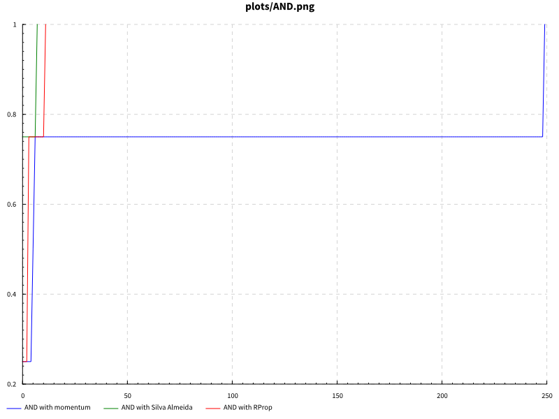{ width=80% }\

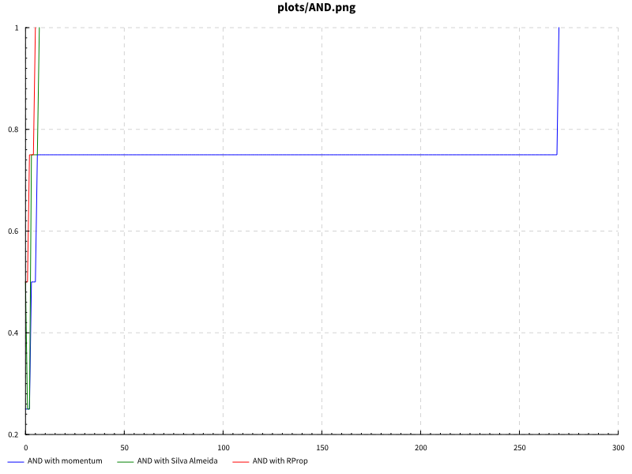{ width=80% }\

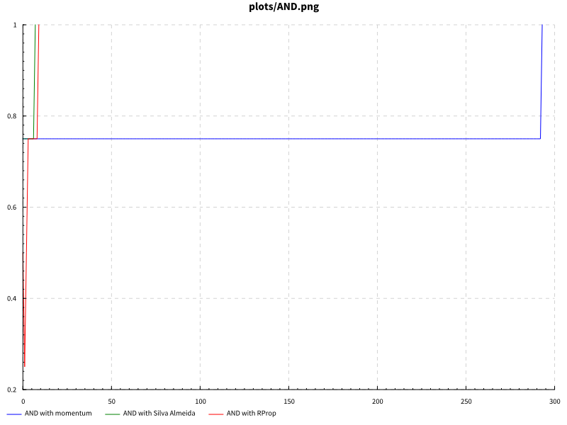{ width=80% }\

## OR

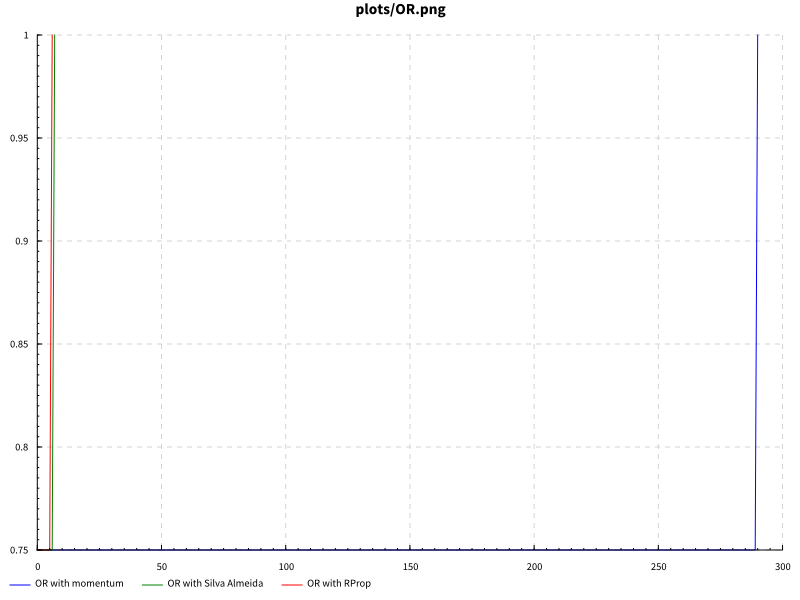{ width=80% }\

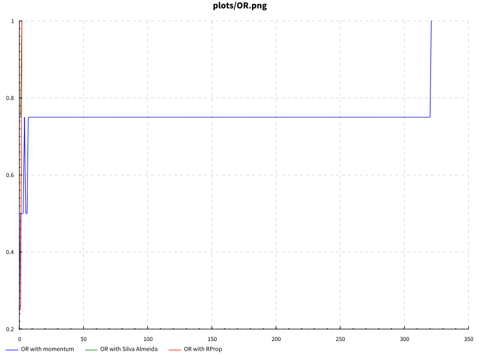{ width=80% }\

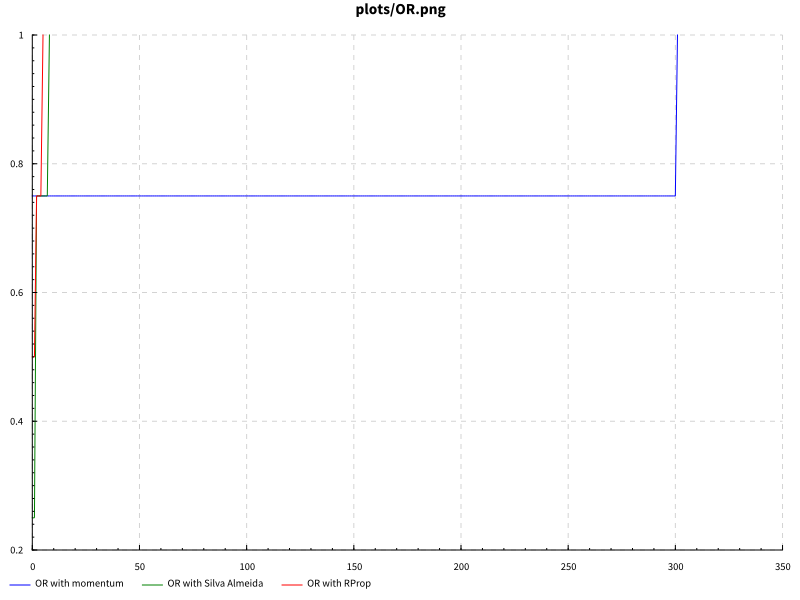{ width=80% }\

## XOR

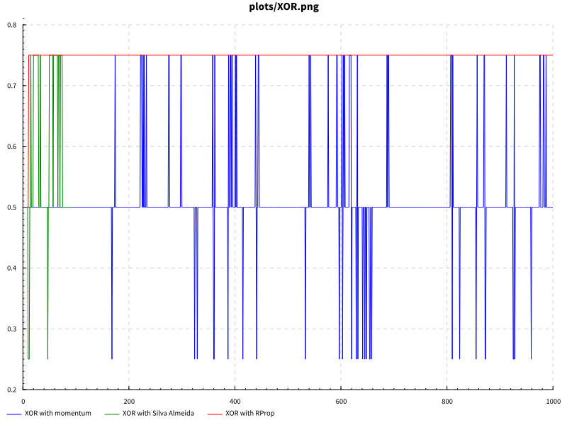{ width=80% }\

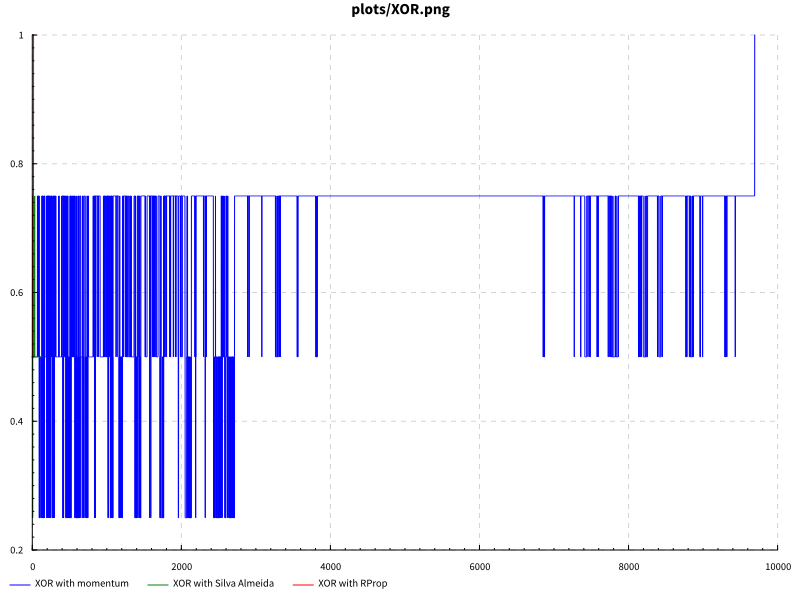{ width=80% }\

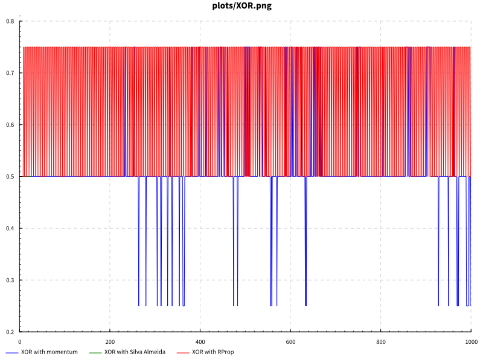{ width=80% }\

## digits

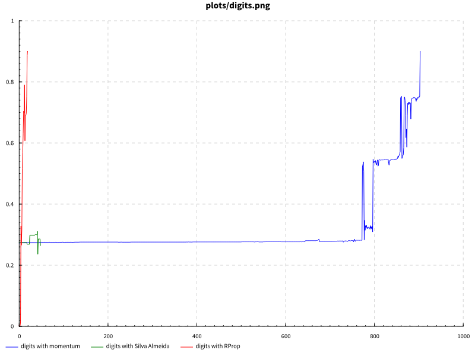{ width=80% }\

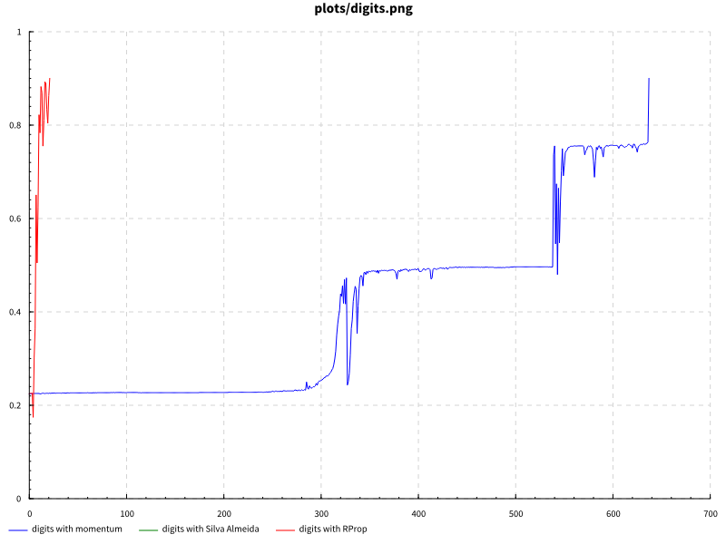{ width=80% }\

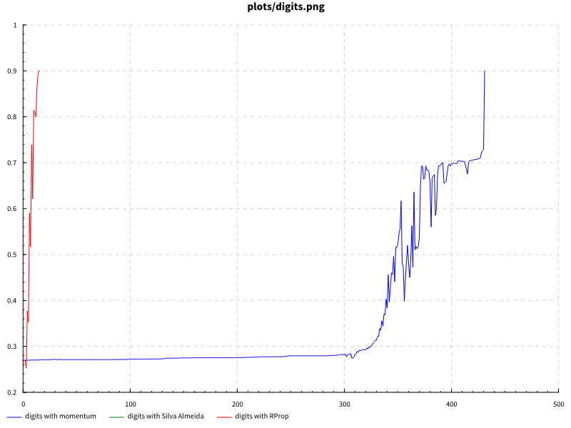{ width=80% }\

